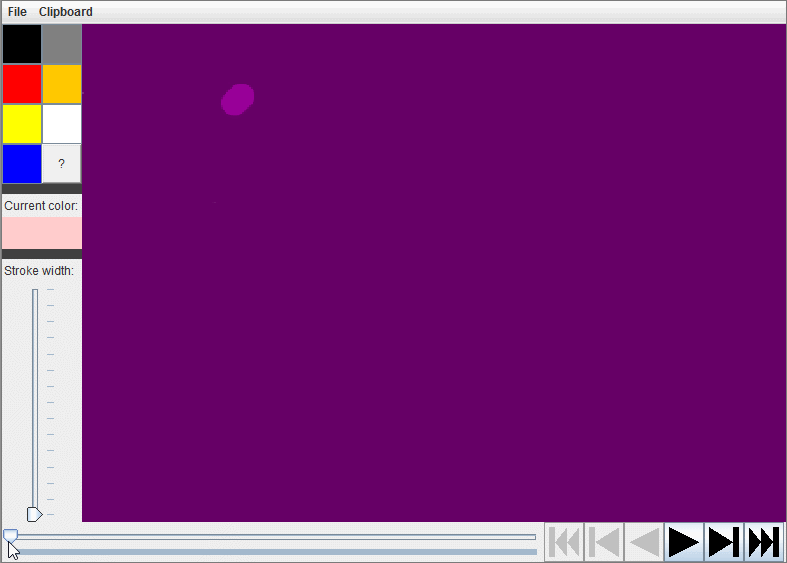

# HistoPaint

A paint application with playback support.

Playback controls include the ability to scrub through the drawing at any point
in time, play the drawing forward or backward at 1 stroke/sec, or jump between
strokes.

A drawing can be saved with its history to be shared or stored for later
progress, or the current frame can be stored in the clipboard.

See `sample_animations` to view example drawings made with the program.
